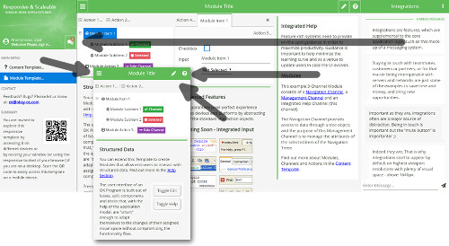

## OK v.5.1

Copyright (c) 2004-2018 Lubo Dyer. All rights reserved.

### Hello, "OK"!

OK is a W3C-compliant software development model and run-time engine to **quickly prototype solutions that scale**.

OK provides **developer-style prototyping** and explores the idea of employing **objects that extend their properties and methods between multiple programming languages**, in this case between PHP, JavaScript, XML (XHTML) and CSS scripting languages - arguably the most popular toolset in the history of the Web.

See OK in action at [okay-os.com](http://okay-os.com).

### Installation

You can run OK in minutes since it does not have any external dependencies, except a PHP-enabled Web Server and a Web Browser.

PHP > 5.3; Latest stable PHP 7 is strongly recommended.

1. Download OK and save it outside of the document root:

  `git clone https://github.com/lubodyer/ok.git`

2. Make sure the `ok/.ok` directory is writable by PHP

3. Create a virtual host and point the document root to the `ok/httpd` directory

4. Open your browser, type the name of the host, and the default application template will be launched. If not, you could figure out what's going on in the `ok/.ok/log/ok.log` file or the web server's error log.

### Default Application Template

As in many comprehensive models that are obsessed with code reuse, in OK advanced objects are created from templates. This template application implements a model for **effective use of visual space** in order to scale UI&amp;UX from low-end (Mobile/IoT) to high-end (HiDPi) device resolutions.

The template application itself contains templates to **provide content to end-users** as well as to **allow end-users to interact with structured data**.

You can always find the latest version of this template as the homepage of [okay-os.com](http://okay-os.com), showcasing the capabilities of the model to deliver feature-rich content and functional experiences.

### License

OK is dual licensed under the GNU Affero General Public License
(GNU AGPLv3) and custom commercial license. Note that it is
NOT required that applications using OK be published. The goal is that
if you modify the core model or the objects, you have to contribute
those modifications back to the community. To enable commercial
scenarios, OK's default application template is provided under the
MIT license.
